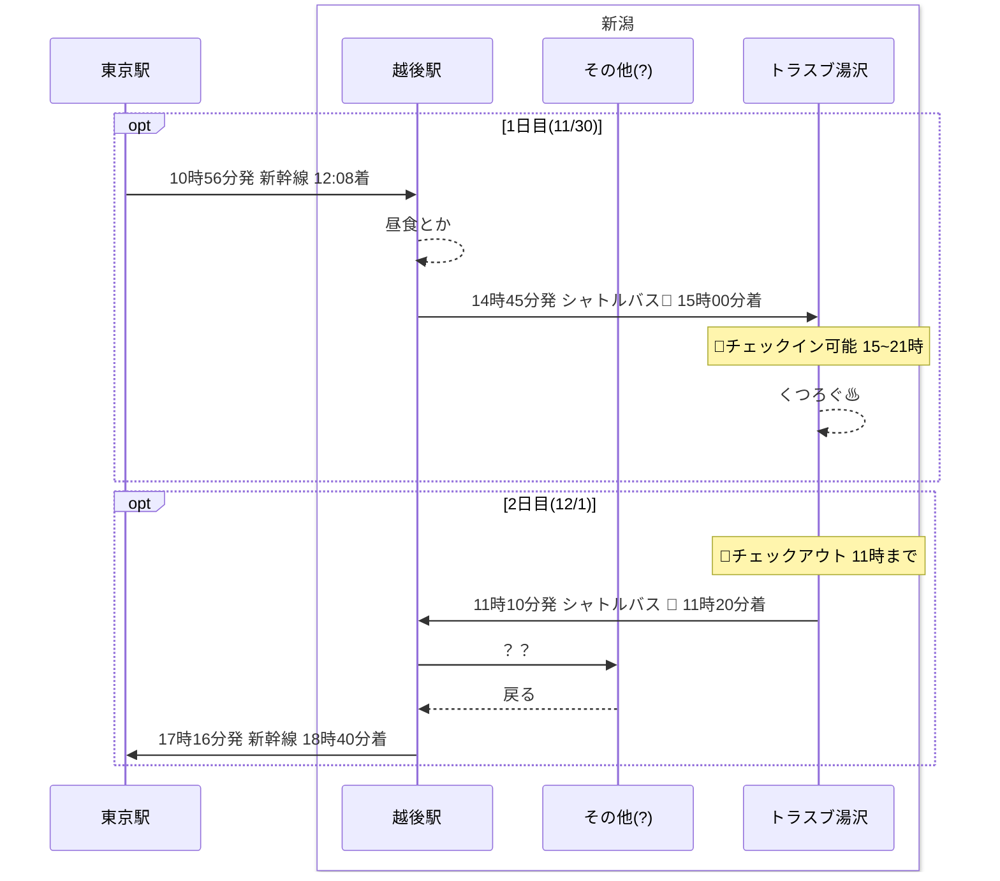

# 旅程

# その他資料

- [公式サイト](https://www.its-kenpo.or.jp/shisetsu/hoyou/chokuei/toslove_yuzawa/index.html)
- [パンフレット](https://www.its-kenpo.or.jp/documents/shisetsu/hoyou/chokuei/toslove_yuzawa/tos_yuzawa_pamph.pdf)
- [シャトルバス](https://www.its-kenpo.or.jp/documents/shisetsu/hoyou/chokuei/toslove_yuzawa/bus20240401.pdf)